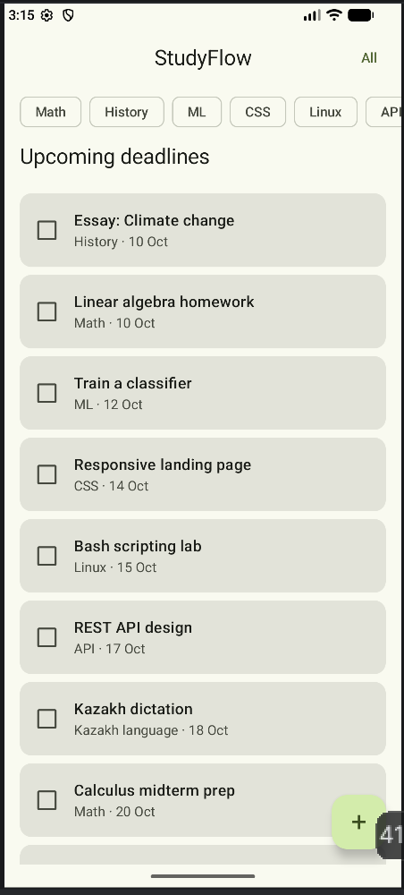
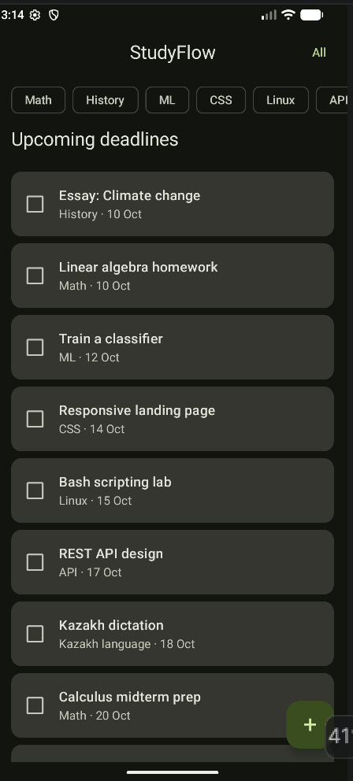
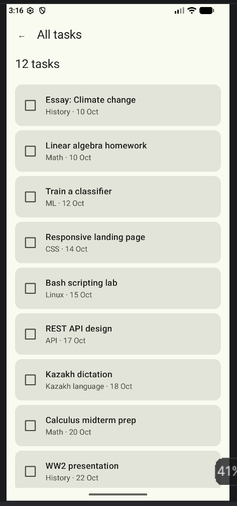
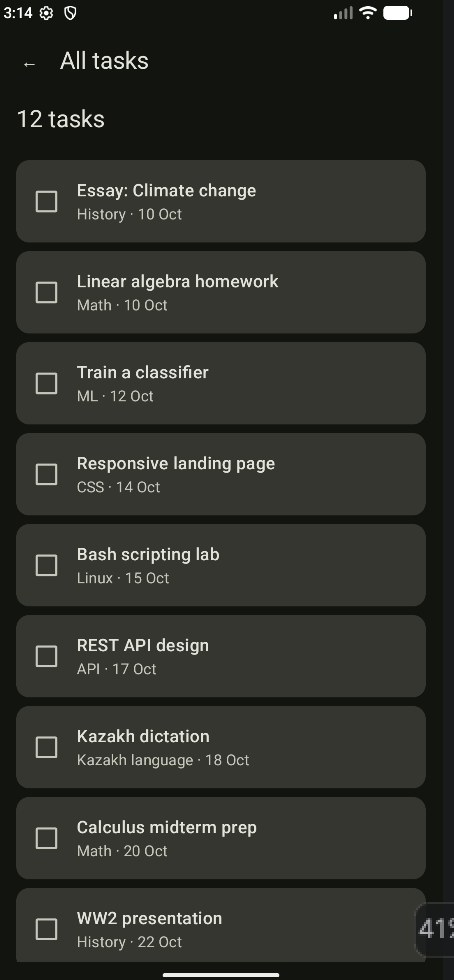
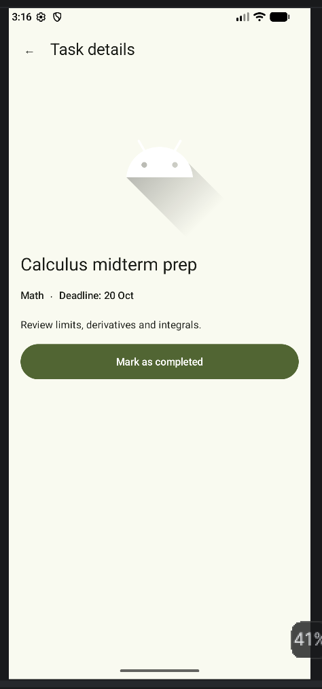
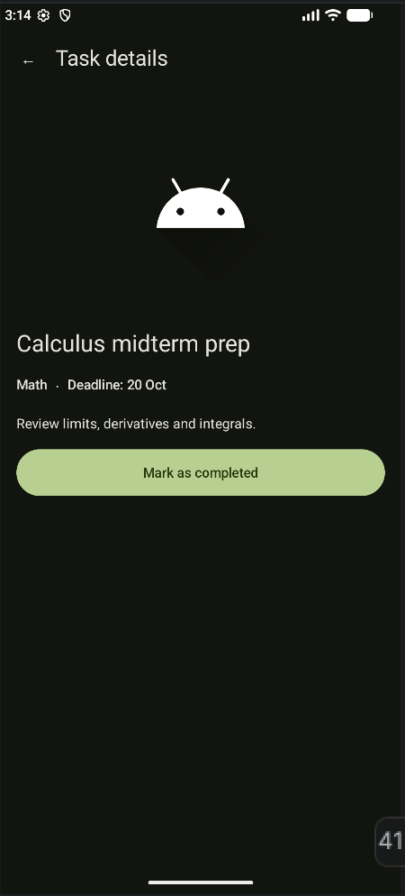
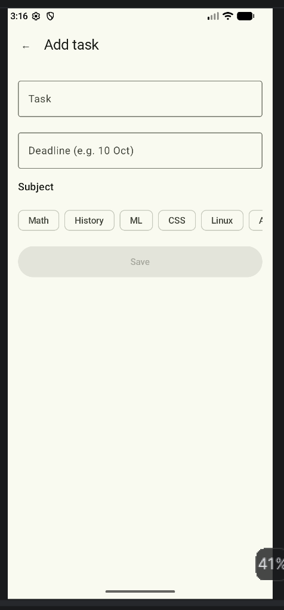
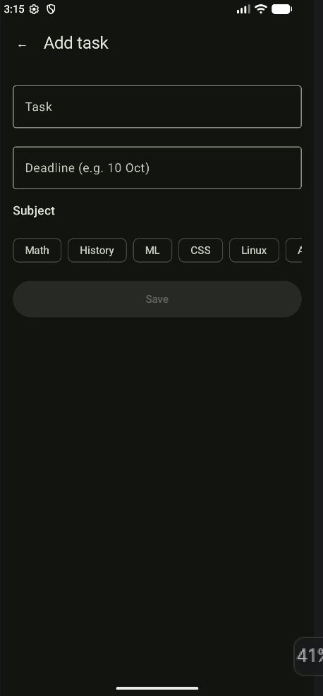

# StudyFlow

StudyFlow is a study task and deadline tracker for university and college students. It keeps subjects and assignments with deadlines in one place, so students can see what is coming up and mark tasks as done.

This project is SIS 3: building the screens of an app with Jetpack Compose (layout and styling). Data is kept in memory (a Kotlin `data class` and a list); saving to disk is out of scope for this assignment.

## Screens

| Screen | Light | Dark |
|---|---|---|
| **Home**: subject chips (`LazyRow`) and upcoming deadlines (`LazyColumn`) |  |  |
| **All tasks**: full list of tasks with an empty state |  |  |
| **Task details**: receives the task `id`, "Mark as completed" toggle |  |  |
| **Add task**: title, deadline, subject chips, Save |  |  |

## Sketch vs. final app

Sketches with labeled blocks (Scaffold, TopAppBar, Column, Row, LazyRow, LazyColumn, Card) are in [`design/StudyFlow.png`](design/StudyFlow.png). They were the first commit of the repository.

What changed between the sketch and the app:

| Sketch | Final app | Why |
|---|---|---|
| "+" button drawn inside the top bar | `FloatingActionButton` at the bottom right | A FAB is the standard Material pattern and easier to tap |
| Subject chips wrapped into 3 rows on Add Task | One horizontal `LazyRow` | `LazyRow` scrolls sideways and does not wrap |
| Circle icon in the task card | `Checkbox` | Shows completed state without extra icon dependencies |
| Task List reached from nowhere | "All" button in the Home top bar | Gives the list screen a clear entry point |
| Back arrow icon | `←` text inside an `IconButton` | Avoids the icons library; the button is still 48 dp |

## How the requirements are covered

- **Layout:** every screen uses `Scaffold` + top app bar; non-start screens have a working back button. Lists use `LazyColumn`, subjects use `LazyRow`. Long titles use `maxLines` + `TextOverflow.Ellipsis`; empty lists show a "No tasks yet" state.
- **Styling:** custom color scheme generated with Material Theme Builder, defined only in `ui/theme`. Screens use `MaterialTheme.colorScheme` and `MaterialTheme.typography`. Spacing comes from the `Spacing` object (4, 8, 16, 24 dp, plus a 48 dp touch target). Dark mode is supported.
- **Structure:** reusable composables `TaskCard`, `SubjectChip`, `SectionHeader`, each with light and dark `@Preview`; every screen also has previews.
- **Navigation and state:** Navigation Compose with routes `home`, `list`, `detail/{taskId}`, `add`. The detail screen gets `taskId` as a navigation argument and finds the task by id. State uses `remember` + `mutableStateOf` (subject filter, completed toggle, form fields).

## Project structure

```
app/src/main/java/com/example/studyflow/
├── data/            Task data class and sample data
├── ui/
│   ├── components/  TaskCard, SubjectChip, SectionHeader
│   ├── screens/     HomeScreen, TaskListScreen, TaskDetailScreen, AddTaskScreen
│   ├── theme/       Color, Theme, Type, Spacing
│   └── AppNavigation.kt
└── MainActivity.kt
design/              labeled sketches
screenshots/         light and dark screenshots
```

## How to run

1. Open the project in Android Studio.
2. Wait for Gradle sync to finish.
3. Press Run on an emulator or a connected device.

## AI usage

See [AI_USAGE.md](AI_USAGE.md).
